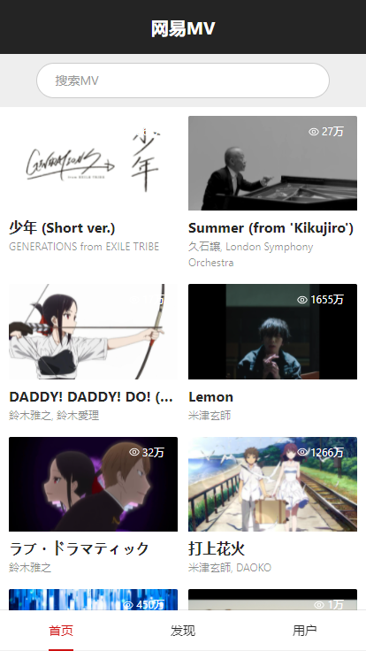
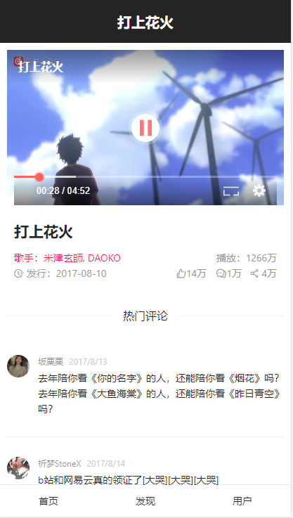
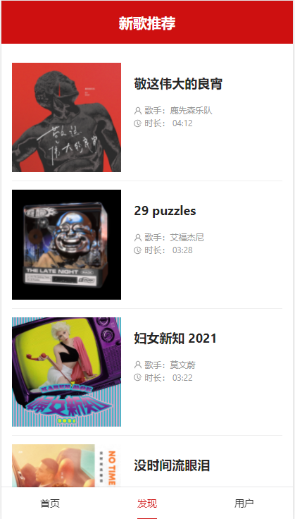
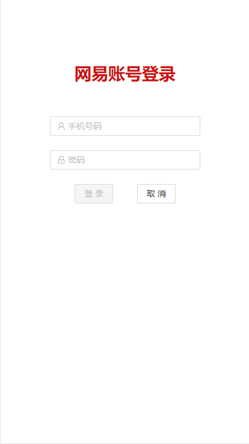
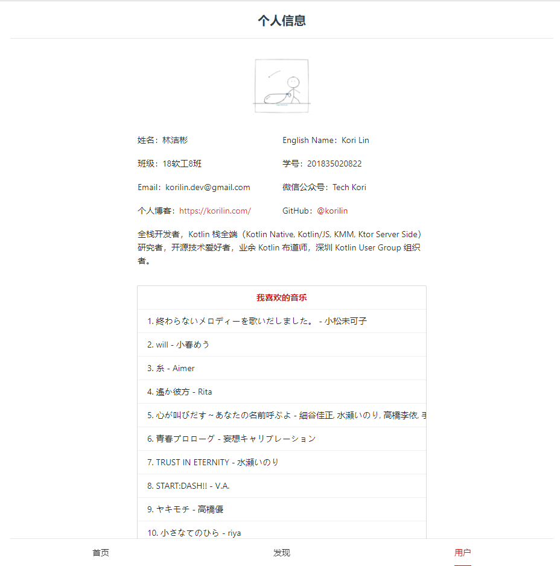

# vite-vue3-demo-netease-cloud-music-mv

 基于 vite 构建的 vue3 示例项目：简易的网易云 MV

 项目日期：2021/6/11

## 须知

本项目为个人在校 Vue 课程大作业，用于学习。

项目依赖于网易云音乐 NodeJS 版 API，项目内使用的所有接口均使用该项目提供的 API：

NeteaseCloudMusicApi：<http://iwenwiki.com/NeteaseCloudMusicApi/>

使用前请确保把这个 API 项目跑起来，端口默认 3000

项目基于 vite 构建，如果使用 npm 无法完成构建的话，建议使用 yarn，别问我为什么，我也不知道。

另外可能项目里面有一些奇奇怪怪的东西，看到就是我拿来做实验的。项目结构和代码我尽量让它们不那么像一坨垃圾了，看不下的话就算了，毕竟是 2 天赶出来的东西。

## 项目相关配置

运行端口：8000

**关于依赖**

| 类型  | 依赖 | 备注 | 链接 |
| --- | --- | --- | --- |
| HTTP 请求工具 | axios.js | - | https://github.com/axios/axios |
| UI 库 | Ant-Design-Vue 2.x  | - |  https://2x.antdv.com/ |
| CSS 预处理器 | Stylus、Less | Less 用于全局载入样式，然后覆盖 Ant-Desgin-Vue 的主题配色 |
| 视频播放器 | vue3-video-player | vue-core-video-player 的 vue3 版本 | https://github.com/LarchLiu/vue3-video-player/ |
| 视频播放器 | vue-core-video-player | 不支持 vue3，无法使用 | https://github.com/core-player/vue-core-video-player |
| 视频播放器 | Vue-Video-Player | 导入时出现未知错误，弃用 | https://github.com/surmon-china/vue-video-player |
| Vue 插件 | vuex@next | 不知道为什么导入了这个依赖，所以拿来存用户信息了 | https://next.vuex.vuejs.org/ |
| Vue 插件 | vue-router@next | 这东西很强大，也很离谱 | https://next.router.vuejs.org/ |

## 项目截图

按照大作业要求，优先做出 webapp 的风格，但在 PC 浏览器放开看也是没问题的，这点我保证。

### MV 列表界面

### MV 详情界面

这里可以看视频的~

### 新歌推荐界面

### 登录界面

进入用户页面需要进行登录，别问我为什么这样做，我也不知道？

### 用户信息界面

登录完就在这里了，这里没有使用手机界面的形式展现，因为下面会截不到~

## 结尾

`script setup` 以及其它的一些新特性用起来很舒服，生态还没完善就很费脑（2021/6/11）。
